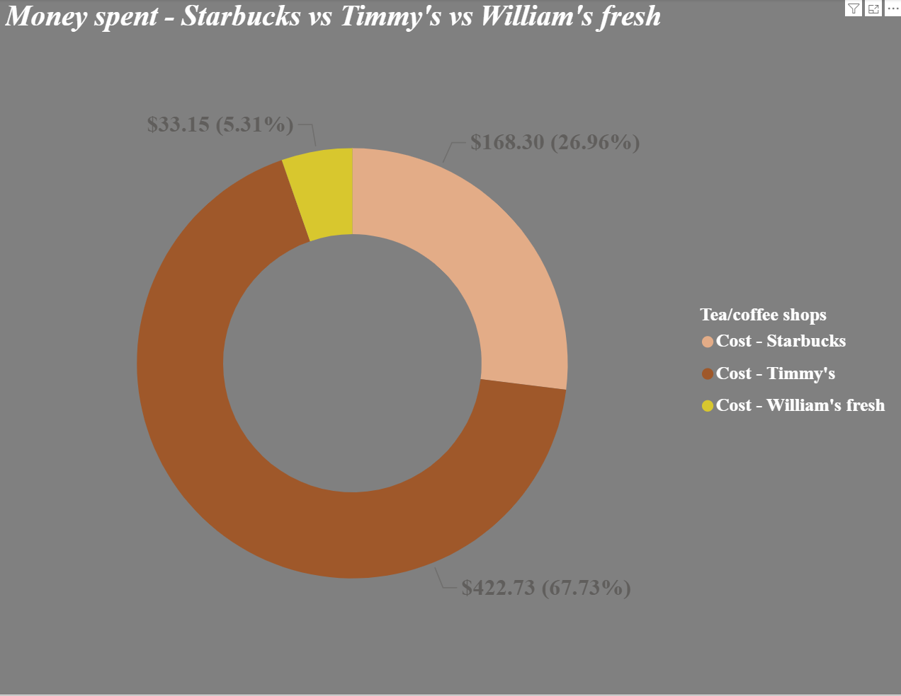

# ☕ Sleep & Caffeine: A Month of Self-Tracking

---

## 🧠 Why I Did This

Over the span of a month, I decided to track two things that often don’t go well together:  
**Caffeine consumption** and **sleep quality**.

I’ve always been curious whether those extra cups of coffee in the afternoon were actually messing with my rest—or if it was just in my head. So instead of guessing, I turned it into a mini data project.  

This wasn't meant to be scientific or perfect, just **an honest self-experiment** to learn more about my own habits and patterns.

---

## 📊 What I Tracked

Every day, I logged the following:

| Category | Description |
|----------|-------------|
| **Date** | Daily logs for the entire month |
| **Day of the Week** | To check for weekday/weekend patterns |
| **Caffeine Consumption** | Number of cups from Timmy’s, Starbucks, and William’s Fresh |
| **Caffeine Level** | A custom score combining amount + source |
| **Sleep Hours** | Actual time slept per night |
| **Calories & Nutrition** | From caffeinated drinks (because it adds up) |
| **Cost of Coffee** | How much I spent daily and at which store |

Here's a snapshot of the raw data I logged:

---

## 📈 Sleep vs Caffeine Level

This was the main focus — I wanted to know whether more caffeine = less sleep.  
Turns out... **it kind of does.**

🔹 **Blue bars** represent caffeine level  
🔴 **Red line** shows sleep hours per day

There were definitely days where a caffeine spike led to short sleep, and some days where a decaf choice made a real difference. I started being more mindful mid-month — and the sleep hours responded.

---

## 💸 Coffee Spending: Where My Money Went

Once I started tracking, I also realized I was spending **way more** on caffeine than I thought. Here’s a quick breakdown:

- ☕ **Timmy’s:** $422.73 (~68%)  
- ☕ **Starbucks:** $168.30 (~27%)  
- ☕ **William's Fresh:** $33.15 (~5%)  

Safe to say, **Timmy’s was my second home.**

---

## 🔍 What I Learned

- I’m very sensitive to caffeine timing — not just amount.
- Small choices (like skipping one drink) noticeably impacted my sleep.
- Tracking made me more intentional about both my consumption and spending.
- Starbucks feels premium... until you see the **accumulated total** 🤯

---

## 🛠 Tools Used

- 📊 **Power BI** — for visuals and dashboards  
- 📋 **Google Sheets / Excel** — for daily data entry  
- 🧠 **Common sense** — once the data was in front of me  

---

## 💭 Final Thoughts

This was one of those projects I started casually but ended up really enjoying. It taught me a lot about my habits — not in a judgmental way, but in a curious, data-powered way.

If you’ve ever wondered how your coffee, sleep, or money habits add up — I’d say try tracking for just a couple of weeks. The patterns will surprise you.

---
## 📬 Let's Connect

I'm always up for chatting about data, dashboards, or daily habits.  
📧 **Email**: rajeshloganathan30@gmail.com  
🔗 **LinkedIn**: [Rajesh Loganathan](https://www.linkedin.com/in/loganathan-rajesh/)

---

## 📂 Repo Structure
